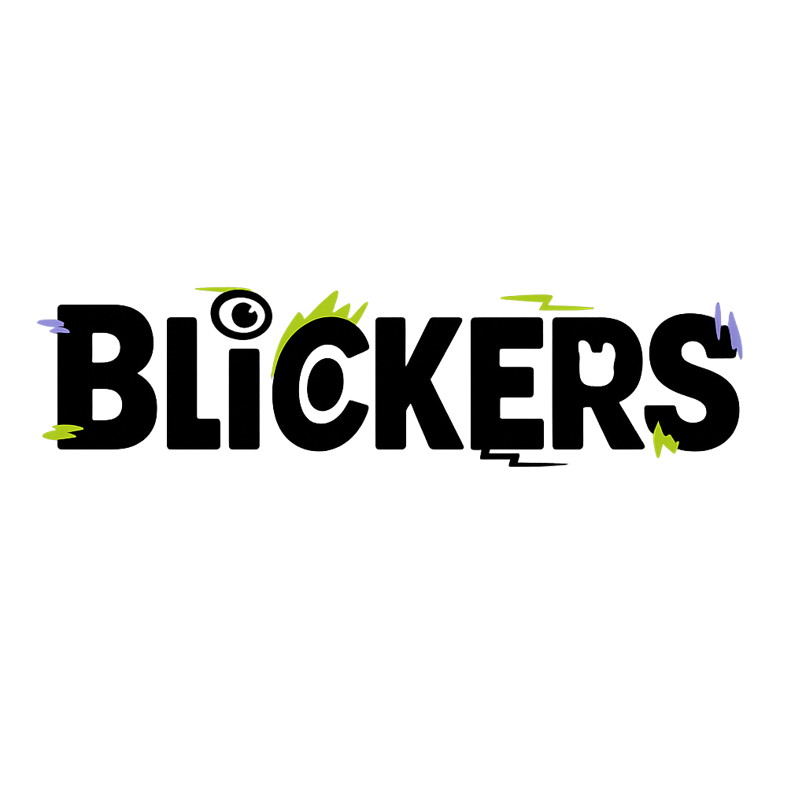

# 🎓 Blinkers – Plateforme Étudiante Associative

Bienvenue sur **Blinkers**, une plateforme web immersive conçue pour dynamiser la vie étudiante au sein des associations et BDE. Ce projet offre une expérience interactive autour des événements, du forum, des vidéos et de la communication en temps réel.

---

## 🚀 Fonctionnalités

- 📰 **Actualités** des événements techno (annulations, reports, nouveautés)
- 📆 **Liste des événements** avec filtres (lieu, date, prix)
- 💬 **Forum et discussions en direct** avec le BDE
- 🧑‍💻 Interface dédiée **+21 ans**

---

## 🖼️ Aperçu



---

## 🛠️ Tech Stack

- **Frontend**: React, GSAP, TailwindCSS
- **Animations**: GSAP + ScrollTrigger
- **Responsive**: 100% mobile-friendly

---

## 🔧 Installation

```bash
# 1. Cloner le dépôt
git clone https://github.com/votre-utilisateur/blinkers-association.git

# 2. Aller dans le dossier
cd blinkers-association

# 3. Installer les dépendances
npm install

# 4. Lancer l'application
npm run dev
